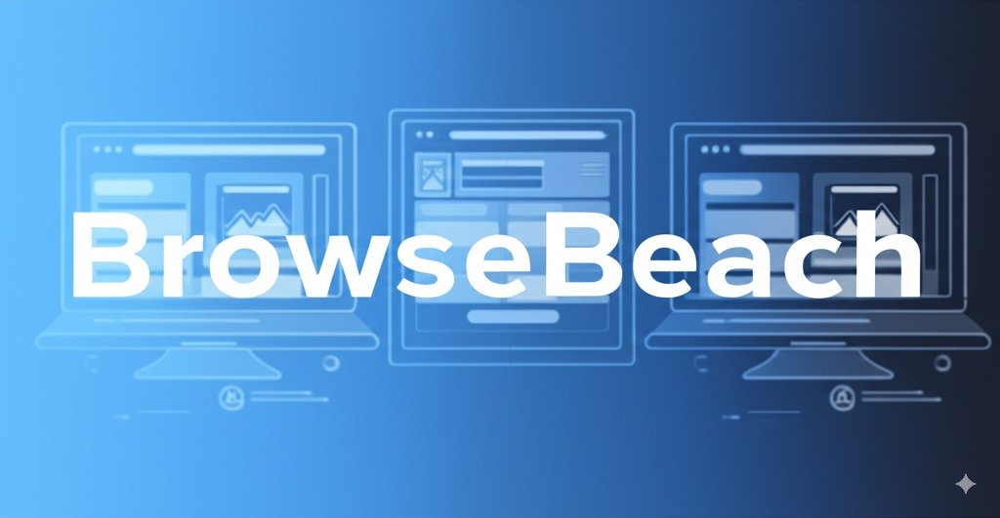

# BrowseBench: AI Web Agent Benchmark

[](https://opensource.org/licenses/MIT)

BrowseBench is an open-source benchmark for evaluating AI agents on web browsing, automation tasks and understanding their ability to interact with the web in realistic ways. BrowseBench provides a framework for measuring these capabilities, helping developers and researchers build more robust AI agents.

## Overview

The web is dynamic and complex, built for human interaction. For AI agents to be truly useful, they need to navigate this complexity effectively. BrowseBench challenges AI models with real-world scenarios, from simple information retrieval to complex multi-step workflows. It enables you to:

- Benchmark your AI agent against leading models
- Identify strengths and weaknesses in your agent's capabilities
- Accelerate research and development in agentic AI
- Contribute to advancing the state of the art

## Features

- **Multi-Model Testing:** Switch between different AI models (GPT-4, Claude, Gemini) through OpenRouter integration
- **Standardized Metrics:** Comprehensive evaluation including efficiency, error recovery, and cost analysis
- **Four Core Test Categories:** Navigation, form interaction, workflows, and robustness testing
- **Extensible Framework:** Add new tests, models, and evaluation metrics as needed
- **Realistic Web Environments:** Tests run on real or synthetic websites that reflect modern web complexity

## Test Categories

BrowseBench includes four core test categories, each evaluating different aspects of AI agent capabilities:

### 1. Navigation & Discovery

Find and extract specific information from websites.
_Example: Locate a SaaS product's pricing page and extract plan features._

### 2. Form Interaction

Complete forms, handle validation errors, and submit data.
_Example: Fill out a registration form with user data and handle validation errors._

### 3. Multi-Step Workflows

Execute sequences of actions across multiple pages to achieve objectives.
_Example: Search for a product, add it to cart, and navigate to checkout._

### 4. Robustness Testing

Handle unexpected interruptions like pop-ups, dynamic content, and slow-loading elements.
_Example: Navigate a news article while dismissing delayed subscription pop-ups._

## Getting Started

### Prerequisites

- Python 3.8+
- Playwright browser automation

### Installation

1. Clone the repository:

```bash
git clone https://github.com/your-org/browsebench.git
cd browsebench
```

2. Set up a virtual environment:

```bash
python3 -m venv .venv
source .venv/bin/activate  # On Windows: .venv\Scripts\activate
```

3. Install dependencies:

```bash
pip install -r requirements.txt
.venv/bin/playwright install
```

4. Set up your API key:

```bash
export OPENROUTER_API_KEY="your-openrouter-api-key"
```

5. Run the benchmark:

```bash
.venv/bin/python -m services.browsebench.runner --model gpt-4
```

## Contributing

We welcome contributions from the community. Please see our [Contributing Guidelines](CONTRIBUTING.md) to get started.

## License

BrowseBench is licensed under the [MIT License](LICENSE).
